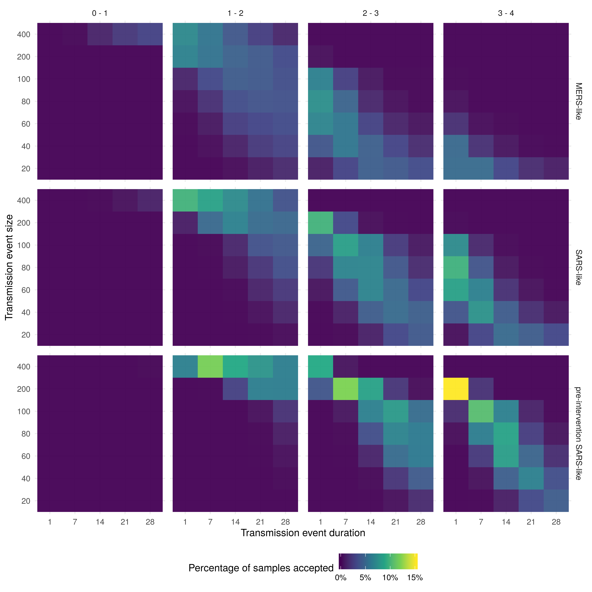

Scenarios and parameter sampling
================================

-   Stratify the analysis by seeding event size and duration:
    -   Event size: 20, 40, 60, 80, 100
    -   Event duration: 7 days, 14 days, 28 days
-   Sampled parameters:
    -   Serial interval: 8.4 (SD: 3.8) from Lispsitch et al. (2003)
    -   K: 0.16 from Lloyd-Smith (2005)
-   Fitted parameters
    -   R0: Uniform(0, 5) prior
-   Case bounds:
    -   Lower bound: 780
    -   Upper bound 880

Scenario analysis
=================

1.  Branching process from `bpmodels`.
    -   Assumes a negative binomial distribution on new cases
    -   Assumes that the serial interval is gaussian distributed.
2.  Run an outbreak for each day of the assumed seeding event.
3.  Summarise outbreaks across a single seeding event.

Restrict scenarios and summarise output
=======================================

-   Restrict potential scenarios based on an upper and lower bound of
    total cases.

-   Summarise each outbreak across samples.

-   Report number of accepted samples per scenario.

-   Condition on reported cases on the 3rd and the 20th of January

Output
======

Compare R0s across scenarios (reporting median, maximum and minimum):

-   Grid of event size vs event duration with R0 estimates.

<table>
<thead>
<tr class="header">
<th style="text-align: right;">Seeding event size vs. Seeding event duration</th>
<th style="text-align: left;">7</th>
<th style="text-align: left;">14</th>
<th style="text-align: left;">28</th>
</tr>
</thead>
<tbody>
<tr class="odd">
<td style="text-align: right;">20</td>
<td style="text-align: left;">3.6 (3.3 - 3.8)</td>
<td style="text-align: left;">3.6 (2 - 4)</td>
<td style="text-align: left;">3.1 (1.6 - 4)</td>
</tr>
<tr class="even">
<td style="text-align: right;">40</td>
<td style="text-align: left;">3.5 (2.7 - 4)</td>
<td style="text-align: left;">3.3 (2.1 - 4)</td>
<td style="text-align: left;">2.6 (1.4 - 4)</td>
</tr>
<tr class="odd">
<td style="text-align: right;">60</td>
<td style="text-align: left;">3.5 (2.3 - 4)</td>
<td style="text-align: left;">3.1 (1.8 - 4)</td>
<td style="text-align: left;">2.3 (1.6 - 4)</td>
</tr>
<tr class="even">
<td style="text-align: right;">80</td>
<td style="text-align: left;">3.3 (2.1 - 4)</td>
<td style="text-align: left;">2.8 (1.9 - 4)</td>
<td style="text-align: left;">2.1 (1.5 - 3.4)</td>
</tr>
<tr class="odd">
<td style="text-align: right;">100</td>
<td style="text-align: left;">3.1 (2.1 - 4)</td>
<td style="text-align: left;">2.6 (1.7 - 4)</td>
<td style="text-align: left;">2 (1.5 - 3.1)</td>
</tr>
<tr class="even">
<td style="text-align: right;">200</td>
<td style="text-align: left;">2.4 (1.6 - 3.8)</td>
<td style="text-align: left;">2 (1.3 - 2.9)</td>
<td style="text-align: left;">1.7 (1.6 - 2.1)</td>
</tr>
</tbody>
</table>

<table>
<thead>
<tr class="header">
<th style="text-align: right;">Seeding event size vs. Seeding event duration</th>
<th style="text-align: left;">7</th>
<th style="text-align: left;">14</th>
<th style="text-align: left;">28</th>
</tr>
</thead>
<tbody>
<tr class="odd">
<td style="text-align: right;">20</td>
<td style="text-align: left;">NA</td>
<td style="text-align: left;">NA</td>
<td style="text-align: left;">3.6 (2.4 - 4)</td>
</tr>
<tr class="even">
<td style="text-align: right;">40</td>
<td style="text-align: left;">NA</td>
<td style="text-align: left;">3.9 (3.8 - 4)</td>
<td style="text-align: left;">3.6 (2.3 - 4)</td>
</tr>
<tr class="odd">
<td style="text-align: right;">60</td>
<td style="text-align: left;">NA</td>
<td style="text-align: left;">3.8 (3.3 - 4)</td>
<td style="text-align: left;">3.4 (2.2 - 4)</td>
</tr>
<tr class="even">
<td style="text-align: right;">80</td>
<td style="text-align: left;">3.9 (3.9 - 3.9)</td>
<td style="text-align: left;">3.8 (3 - 4)</td>
<td style="text-align: left;">3.3 (1.9 - 4)</td>
</tr>
<tr class="odd">
<td style="text-align: right;">100</td>
<td style="text-align: left;">3.9 (3.8 - 4)</td>
<td style="text-align: left;">3.7 (2.7 - 4)</td>
<td style="text-align: left;">3.1 (1.7 - 4)</td>
</tr>
<tr class="even">
<td style="text-align: right;">200</td>
<td style="text-align: left;">3.7 (2.5 - 4)</td>
<td style="text-align: left;">3.3 (2.1 - 4)</td>
<td style="text-align: left;">2.4 (1.7 - 3.3)</td>
</tr>
</tbody>
</table>
